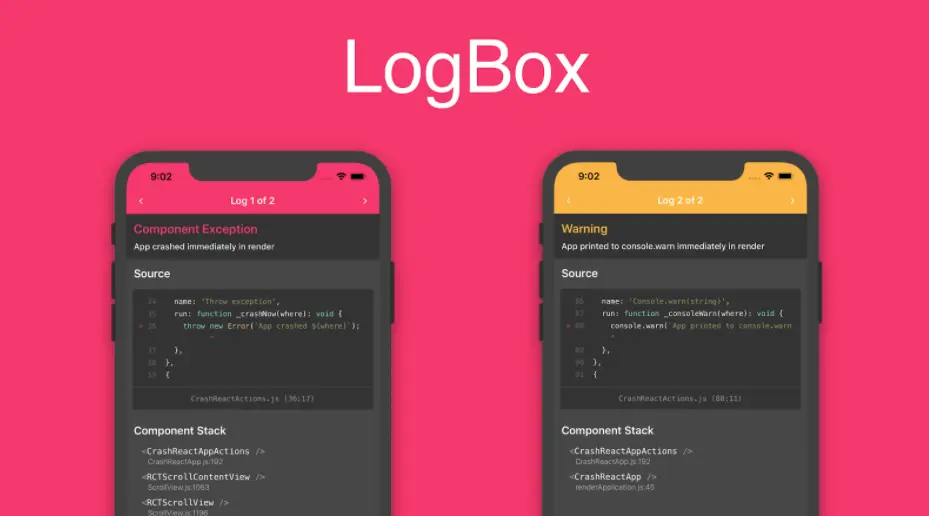

# 调试

### 开启调试的快捷键
    React Native 在 iOS 模拟器上支持一些快捷键操作。
    要使用快捷键请务必确保模拟器的 Hardware 菜单中，Keyboard 选项下的"Connect Hardware Keyboard"处于开启状态，否则按键是没有响应的。

### 访问 App 内的开发菜单
    你可以通过摇晃设备或是选择 iOS 模拟器的"Hardware"菜单中的"Shake Gesture"选项来打开开发菜单。
    另外，如果是在 iOS 模拟器中运行，还可以按下Command⌘ + D 快捷键，Android 模拟器对应的则是Command⌘ + M（windows 上可能是 F1 或者 F2），或是直接在命令行中运行adb shell input keyevent 82来发送菜单键命令。

### UI刷新
    具体的操作就是在开发菜单中点击"Reload"选项。
    也可以在 iOS 模拟器中按下Command⌘ + R ，Android 模拟器上对应的则是按两下R 。
但有些时候你必须要重新编译应用（run-ios 或是 run-android）才能使修改生效：
- 增加了新的资源(比如给 iOS 的Images.xcassets或是 Andorid 的res/drawable文件夹添加了图片)
- 更改了任何的原生代码（objective-c/swift/java）

### LogBox

### Chrome 开发者工具
在开发者菜单中选择"Debug JS Remotely"选项，即可以开始在 Chrome 中调试 JavaScript 代码。点击这个选项的同时会自动打开调试页面 http://localhost:8081/debugger-ui.(如果地址栏打开的是 ip 地址，则请自行改为 localhost)

使用 Chrome 调试目前无法观测到 React Native 中的网络请求，你可以使用功能更强大的第三方的react-native-debugger或是官方的flipper（注意仅能在 0.62 以上版本可用）来观测。

### React Developer Tools
可以使用独立版 React 开发者工具(不是 chrome 的插件)来调试 React 组件层次结构。要使用它，全局安装react-devtools包:
<table><tr><td bgcolor=#000000>npm install -g react-devtools</td></tr></table>
安装完成后在命令行中执行react-devtools即可启动此工具：
<table><tr><td bgcolor=#000000>react-devtools</td></tr></table>

### 访问控制台日志

在运行 RN 应用时，可以在终端中运行如下命令来查看控制台的日志：
<table>
<tr><td bgcolor=#000000>

npx react-native log-ios
  npx react-native log-android
</td></tr>
</table>
此外，你也可以在 iOS 模拟器的菜单中选择Debug → Open System Log...来查看。如果是 Android 应用，无论是运行在模拟器或是真机上，都可以通过在终端命令行里运行adb logcat *:S ReactNative:V ReactNativeJS:V命令来查看。