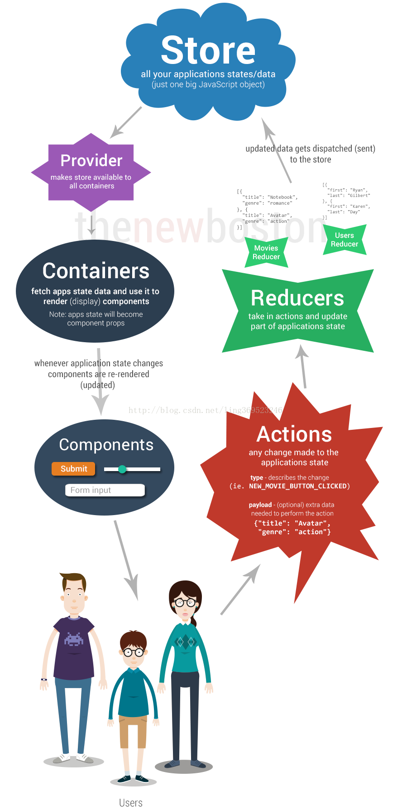

# Redux

### react-native 数据传递
    react-native 的数据传递是父类传递给子类。
    子类通过this.props.** 读取数据，这样会造成组件多重嵌套

### action
    纯声明式的数据结构，只提供事件的所有要素，不提供逻辑，同时尽量减少在 action 中传递的数据
### reducer
    一个匹配函数，action的发送是全局的，所有的reducer都可以捕捉到并匹配与自己相关与否，相关就拿走action中的要素进行逻辑处理，修改store中的状态，不相关就不对state做处理原样返回。reducer里就是判断语句
### Store
    把以上两个联系到一起的对象，Redux 应用只有一个单一的 store。
    当需要拆分数据处理逻辑时，你应该使用reducer组合 而不是创建多个 store。
### Provider
    一个普通组件，可以作为顶层app的分发点，它只需要store属性就可以了。它会将state分发给所有被connect的组件，不管它在哪里，被嵌套多少层
### connect
    一个科里化函数，意思是先接受两个参数（数据绑定mapStateToProps和事件绑mapDispatchToProps）再接受一个参数（将要绑定的组件本身）。mapStateToProps：构建好Redux系统的时候，它会被自动初始化，但是你的React组件并不知道它的存在，因此你需要分拣出你需要的Redux状态，所以你需要绑定一个函数，它的参数是state，简单返回你需要的数据，组件里读取还是用this.props.*
### container
    做component容器和props绑定， 负责输入显示出来，component通过用户的要交互调用action这样就完整的流程就如此
