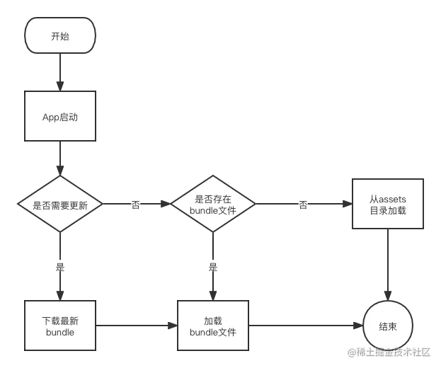
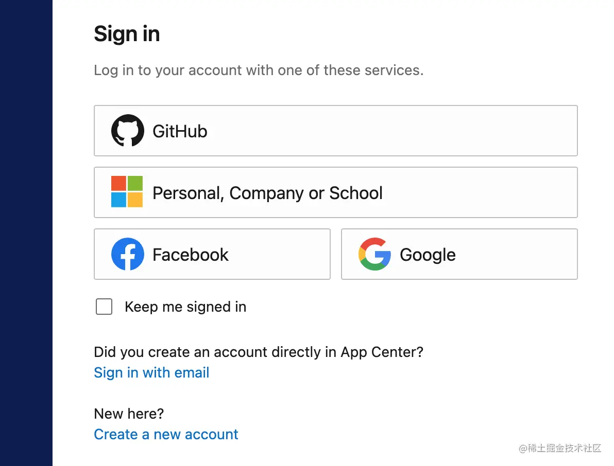
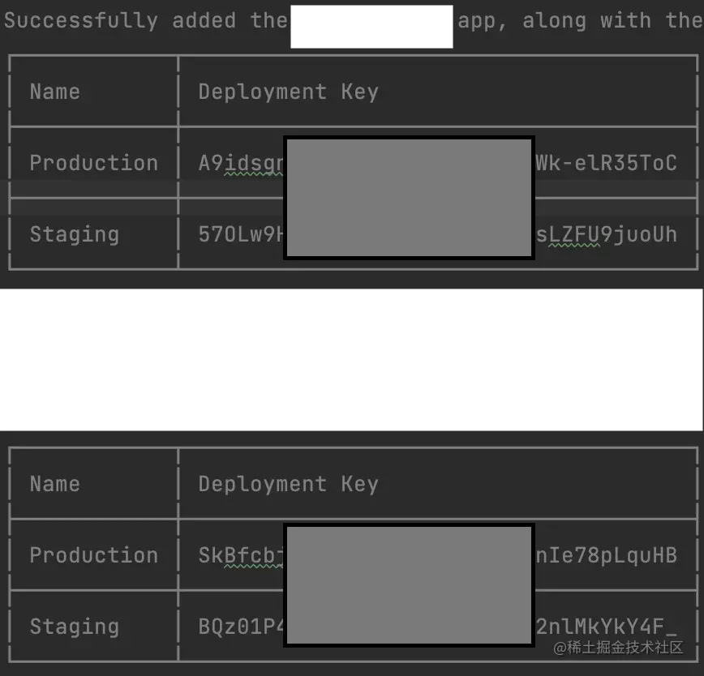
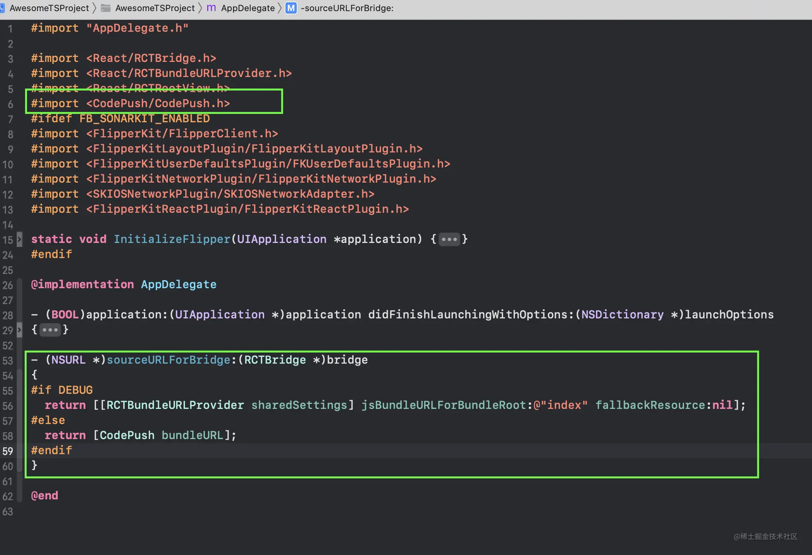
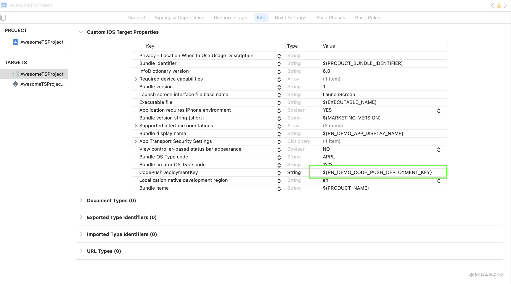
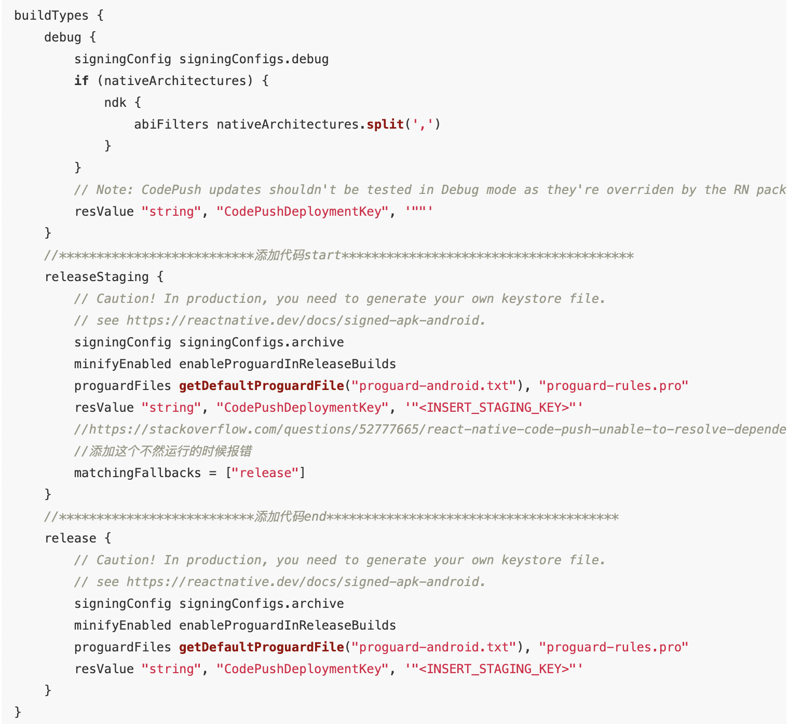
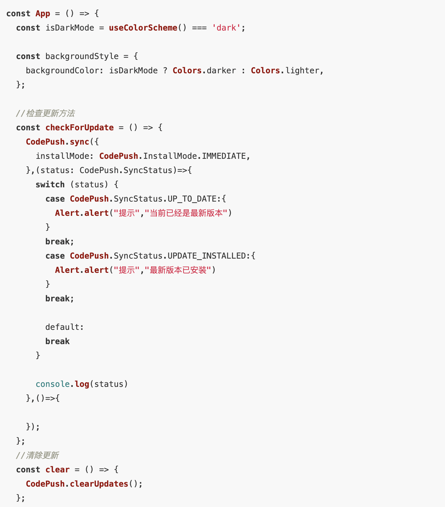

# CodePush

- ### 原理

- ### 环境
    node:v16.13.2
    npm:8.1.2
    yarn:1.22.17
    react:17.0.2
    react-native:0.67.2,
    react-native-code-push:^7.0.4
    Xcode：Version 13.2.1 (13C100)
    Android Studio：Android Studio Bumblebee | 2021.1.1 Patch 1
    Gradle：com.android.tools.build:gradle:7.1.1
- ### 集成
    - #### 安装appcenter
        npm install -g appcenter-cli
    - #### AppCenter相关操作
      - 登录操作
        - 终端中输入登录命令：appcenter login，执行后会自动打开浏览器让你选择一种登录方式，我选的是github
        
        - 登录后会生成一串token，复制下来
        
    - #### 其他命令
        查看配置：appcenter profile list
        退出登录：appcenter logout
        查看所有的登录token：appcenter tokens list
        删除一个token：appcenter tokens delete <machineName>

- ### 分别创建ANDROID/IOS App
  - #### 针对不同系统分别执行下面的命令
    appcenter apps create -d <appDisplayName> -o <operatingSystem>  -p <platform> 
     例如针对iOS和安卓分别执行如下命令:
    appcenter apps create -d RNDemoAndroid -o Android -p React-Native
    appcenter apps create -d RNDemoiOS -o iOS -p React-Native

  - #### 在Appcenter创建完App之后需要针对每个App创建Staging和Production 环境对应的Key:
    appcenter codepush deployment add -a <ownerName>/RNDemoiOS Staging
    appcenter codepush deployment add -a <ownerName>/RNDemoiOS Production
      最后我们将得到iOS和Android两组共四个CodePush Deployment Key，如下图所示
    

- ### ReactNative项目安装CodePush
        npm install --save react-native-code-push
- ### ReactNative中iOS项目修改
  - #### 为iOS项目安装依赖
    在项目目录中执行 cd ios && pod install && cd .. 安装pod文件中的依赖并返回到项目主目录
  - #### 使用Xcode打开ios主目录下的.xcworkspace文件编辑AppDelegate.m
    引入CodePush头文件
    将代码 [[NSBundle mainBundle] URLForResource:@"main" withExtension:@"jsbundle"]; 替换为return [CodePush bundleURL];
    如图所示:
    
  - #### iOS codepush Key
    修改项目中的Info.plist文件，key为CodePushDeploymentKey，value为xcconfig文件中的值${RN_DEMO_CODE_PUSH_DEPLOYMENT_KEY}
    

- ### ReactNative中Android项目修改
    - #### 修改android/settings.gradle，添加如下代码
        include ':app', ':react-native-code-push'
        project(':react-native-code-push').projectDir = new File(rootProject.projectDir, '../node_modules/react-native-code-push/android/app')

    - #### 修改android/app/build.gradle
        在文件中找到apply from: "../../node_modules/react-native/react.gradle"
        在这一行下面添加apply from: "../../node_modules/react-native-code-push/android/codepush.gradle"

    - #### 修改MainApplication.java文件
        // 1. Import the plugin class.
        import com.microsoft.codepush.react.CodePush;
        public class MainApplication extends Application implements ReactApplication {
        private final ReactNativeHost mReactNativeHost = new ReactNativeHost(this) {
            ...
            // 2. Override the getJSBundleFile method to let
            // the CodePush runtime determine where to get the JS
            // bundle location from on each app start
            @Override
            protected String getJSBundleFile() {
                return CodePush.getJSBundleFile();
            }
        };
        }
    - #### iOS codepush Key
        在 build.gradle(:app)中找到buildTypes代码块，并作如下修改
        将<INSERT_STAGING_KEY>替换成你在codepush中的deploymentKey
        

- ### ReactNative TS/JS代码修改
    

- ### 打包发布
        appcenter codepush release-react -a yourusername@163.com/RNDemoiOS

